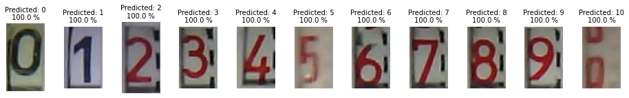

# About



# Installation

1. Install PyTorch by following the official guidelines https://pytorch.org/get-started/locally/
2. Install from pip `pip install meter-digits-recognizer`

# Minimal Exmple

```python
import cv2
from meter_digits_recognizer import MeterDigitsRecognizer

# Read image, must be in BGR format (standard in OpenCV)
image = cv2.imread("images/0/1_hot_water_meter_20210212_065239.jpg")

# Run recognizer
dr = MeterDigitsRecognizer()
predictions, confidences = dr.run([image]) # Accepts list of images

# Print
print("Prediction %d (confidence %.1f %%)" % (predictions[0], confidences[0]))
```

Expected output:

```
Prediction 0 (confidence 100.0 %)
```

For additional examples see [example.ipynb](example.ipynb)